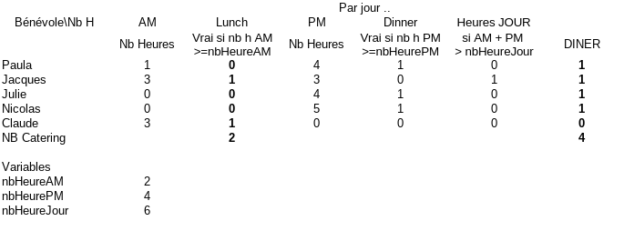

# catering

Présences bénévoles par demi-journée et par lieu → nombre de repas à prévoir.
Analyse : `../doc-travail/2026-09-10-noe-exploitation-donnees-benevoles.md` (local).

### Les plages de temps : 
- matinée : 08:00-13:00 ; 
- soirée : 13:00-24:00 ;

### TABLEAU RENDU ATTENDU

	Par jour ..
Bénévole\Nb H	AM	Lunch	PM	Dinner	Heures JOUR	
	Nb Heures	Vrai si nb h AM >=nbHeureAM	Nb Heures	Vrai si nb h PM >=nbHeurePM	si AM + PM 
> nbHeureJour	DINER
Paula	1	0	4	1	0	1
Jacques	3	1	3	0	1	1
Julie	0	0	4	1	0	1
Nicolas	0	0	5	1	0	1
Claude	3	1	0	0	0	0
NB Catering		2				4
						
Variables						
nbHeureAM	2	<- repas du matin sur son lieu 				
nbHeurePM	4	<- repas du soir sur son lieu
nbHeureJour	6	<- dans tous les cas : 2 repas, sur les lieux où il est AM et PM

#### Rendu résutat affichable :
JOURNÉE DU dd/mmm
Bénévole\Nb	Nb_Lunch    Nb_Dinner
Paula		    0	        1
Jacques		    1	        1
Julie		    0	        1
Nicolas		    0           1
Claude		    1           0
NB tot		    2           4
### Modalités de rendu
- un fichier .ods comme l'exemple en téléchargement sur seafile : OK pour ecraser la version précédente en gardant 1 copie de backup plus une copie par jour achevé
- visualisation rapide : idéalement une page sur mobile android, dans un pas html ou pdf en format adapté

### Analyse et update : 
a part l'analyse initiale, bien-sûr, la mide ajour auto se ferait tous les jour à 06:00 ; 12:00 ; 16:00 ; 20:00
